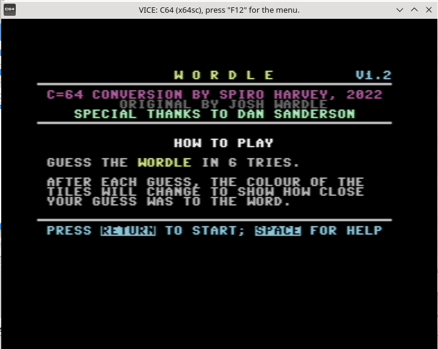
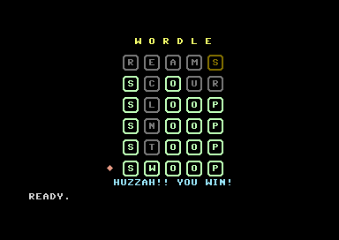

# WORDLE for c=64

c=64 conversion by Spiro Harvey, 2022

The first version of Wordle to be released on the Commodore64! (first released Jan 5, 2022)

## HOW TO RUN IT

* Download the PRG file
* Run the PRG file with an emulator like VICE

That's it!

Of course you can save it to a .D64 file, transfer to real hardware, or load on TheC64 if you like.

## Plus/4 port by Luca/FIRE

[Luca](https://plus4world.powweb.com/members/Luca)/[FIRE](https://plus4world.powweb.com/groups/FIRE) has ported v1.3 to the Commodore Plus/4.

Luca is co-maintainer of the [Plus/4 World](https://plus4world.powweb.com/) archive. 

